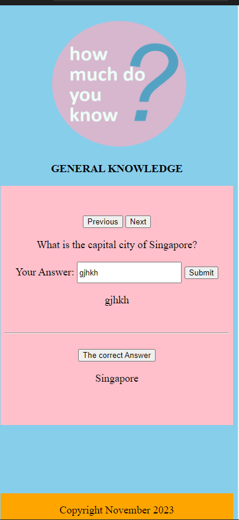

# How Much Do You Know Website PP2   

#### Here is the link: [How Much Do you You Know] (https://ledanken.github.io/how-much-do-you-know/) 

#### Here's how the website looks like:  

#### 

#### I did a submitted feedback-form-display, and it is strange that is not running with Gitpod, but in my local IDE, it does. Gitpod has not been running well with me these past days. That's why, I mostly decided to do it with my local IDE. I just hope, that this would run upon deployment.  

#### Here is the image:  

####     

#### This website is meant mainly to apply what I learned in Javascript from [Code Institute](https://codeinstitute.net). As you can see, there is not much of html and css designs and styles. But this is another website that I would like to continue afterwards. 

#### I also would like to mention [stackoverflow](https://stackoverflow.com/questions/26944987/show-next-previous-item-of-an-array) for helping me with the code on Previous-Next Buttons as it took me so much time to code it with adEventListener Method and it was not running! 

#### This website is hoping to grow with more questions and categories in the future. 

### Many thanks!
